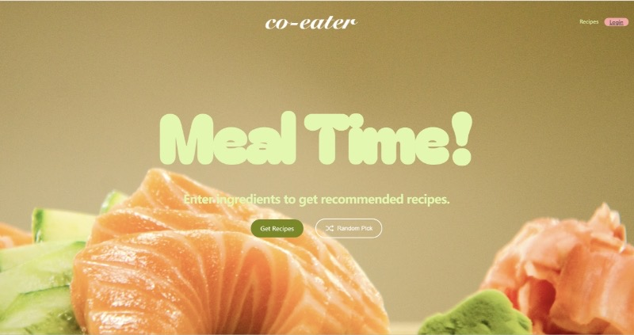

# 🍽️ Recipes Sharing Platform (Cloud-Based Web App)

A full-stack recipe sharing platform developed as part of a cloud computing course project. This platform enables users to share, discover, and interact with recipes in a scalable and cloud-friendly environment.

## 🌐 Features

- 📝 User Registration & Login (Authentication & Authorization)
- 📸 Recipe Upload with Image Support
- 🔍 Browse & Search Recipes by Category, Ingredients, etc.
- ❤️ Like, Comment, and Save Favorite Recipes
- 🧑‍🍳 User Profiles and Personal Recipe Collections
- 📊 Admin Panel for Content Moderation (Optional)

## 🧱 Tech Stack

### Frontend
- React + Vite
- Tailwind CSS
- Axios (API Communication)

### Backend
- Node.js + Express
- MySQL (Relational Database)
- RESTful API Design

### Cloud Infrastructure (AWS)
- EC2 (Application Hosting)
- RDS (MySQL Database)
- S3 (Image Storage)
- IAM (Role Management & Permissions)
- CloudWatch (Monitoring & Logs)

## 🚀 Getting Started

### Prerequisites
- Node.js (v18+)
- MySQL
- Git

### Installation (Local)

```bash
# Clone the repository
git clone https://github.com/LiuMingyue1/Recipes-Sharing-Platform.git
cd Recipes-Sharing-Platform

# Frontend Setup
cd frontend
npm install
npm run dev

# Backend Setup
cd ../backend
npm install
# Configure .env for DB credentials
npm start
# Database Setup
CREATE DATABASE recipe_platform;
```


### 🏠 Homepage


